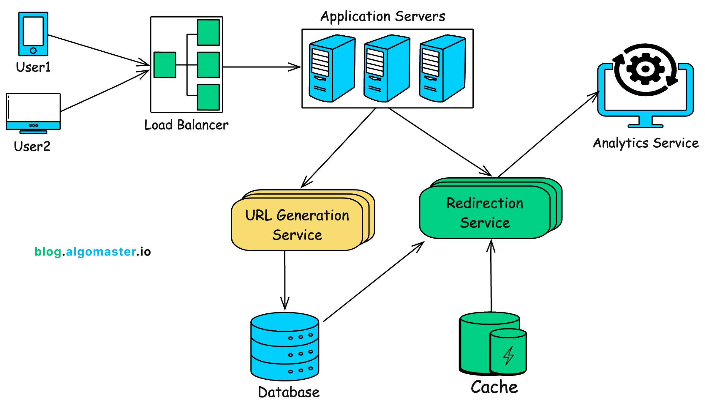

# URL 短網址系統

這是一個使用 FastAPI 和 SQLite 實作的 URL Short System Website

## 功能

- 創建短網址
- 通過短網址重定向到原始 URL
- Support URL Validation
- 設定短網址有效期（default == 30 天）

## System Design Architecture Diagram


### Reference
參考了這一篇文章 https://blog.algomaster.io/p/design-a-url-shortener

## API 文件

### API 1: 創建短網址

- **URL**: `/api/shorten`
- **方法**: POST
- **請求體**:
  ```json
  {
    "original_url": "https://example.com/very/long/url"
  }
  ```
- **成功回應**:
  ```json
  {
    "short_url": "http://localhost:8000/r/abcd1234",
    "expiration_date": "2023-11-29T10:15:30.123456",
    "success": true
  }
  ```
- **失敗回應**:
  ```json
  {
    "short_url": "",
    "expiration_date": "2023-10-30T10:15:30.123456",
    "success": false,
    "reason": "Invalid URL format or URL too long"
  }
  ```

### API 2: 短網址重定義

- **URL**: `/r/{short_code}`
- **方法**: GET
- **行為**: 回到原始 URL，如果短網址已經失效或過期則返回錯誤

## 使用 Docker 運行

### 使用 Docker Compose

```bash
docker-compose up -d
```

### 直接使用 Docker

```bash
docker build -t url-shortener .
docker run -p 8000:8000 url-shortener
```

## 進入網站

啟動後，可藉由瀏覽器瀏覽：

- API File：http://localhost:8000/docs
- Website：http://localhost:8000/